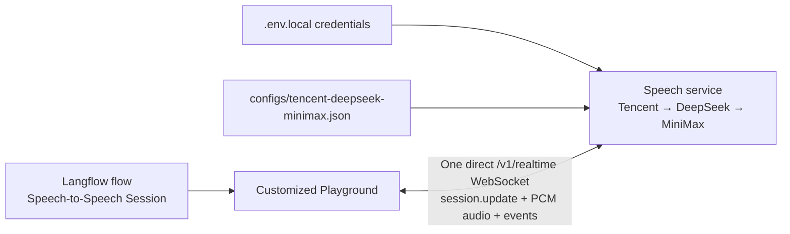

# Langflow Speech-to-Speech Playground Design

## Summary

Create a reproducible, customized Langflow distribution whose Playground is a
live frontend for this repository's OpenAI Realtime-compatible speech service.
The Playground will capture microphone audio, exchange audio and events over one
direct WebSocket, play synthesized audio, show live transcripts, and apply
supported session settings without restarting the service.

The local provider pipeline remains:

1. Tencent ASR
2. DeepSeek chat completions
3. MiniMax TTS

Credentials and provider-specific launch settings remain server-side in
`.env.local` and `configs/tencent-deepseek-minimax.json`. Langflow controls
per-session behavior through the existing `session.update` WebSocket event.

## Goals

- Make the customized Langflow Playground a complete microphone-and-speaker
  client for `/v1/realtime`.
- Save speech session behavior in a Langflow flow.
- Apply supported setting changes to an active WebSocket session.
- Ship defaults that work with the repository's current local configuration.
- Keep provider credentials out of the browser, flow JSON, and committed files.
- Package the result as a pinned, reproducible Langflow customization.

## Non-goals

- Switching STT, LLM, or TTS providers at runtime.
- Changing provider credentials through Langflow.
- Starting or restarting the speech service when a session setting changes.
- Executing connected Langflow tools during voice conversations in the initial
  version.
- Supporting WebRTC in the initial version.
- Replacing Langflow's general-purpose flow editor.

## Architecture

The speech service and Langflow remain independently deployable processes.
Langflow is the configuration and interaction frontend; the speech service owns
the provider pipeline and realtime conversation state.



The browser connects directly to the speech service. Langflow does not proxy
audio, so it does not add an extra latency hop. The browser-visible service URL
is not a secret.

## Customized Langflow Distribution

Add an `integrations/langflow/` package to this repository containing:

- An exact upstream Langflow commit reference.
- A small patch set for the upstream frontend.
- A custom component bundle.
- A preloaded starter flow.
- A multi-stage Dockerfile.
- A dedicated Docker Compose file.
- Safe environment examples and operating documentation.

The build must pin an exact upstream commit, not `latest`. The image should carry
the upstream version and commit as labels. Updating Langflow is an explicit
patch-rebase operation.

The custom distribution should avoid vendoring unrelated upstream source into
this repository. Its build may retrieve the pinned source, apply the checked-in
patch set, build the frontend, and copy the result into a pinned Langflow runtime
image. Both the source and runtime references must resolve to the same upstream
version.

## Environment Contract

The speech service receives `.env.local` and the checked-in JSON profile.
Langflow must not receive provider credentials.

The safe browser endpoint is configured with:

```text
SPEECH_TO_SPEECH_URL=ws://localhost:8765/v1/realtime
```

This default matches the current `ws_host`, `ws_port`, and realtime path. The
custom component reads this environment variable when Langflow loads its
template. A blank per-flow URL means "use the environment default"; a nonblank
value overrides it for that flow.

The URL must be browser-reachable. In the local Compose topology,
`ws://localhost:8765/v1/realtime` is correct because the connection originates
in the browser, not in the Langflow container.

## Flow Configuration Model

Each voice-enabled flow must contain exactly one `Speech-to-Speech Session`
component. The component is the source of truth for:

- Instructions
- MiniMax voice ID
- VAD threshold
- Silence duration in milliseconds
- Interrupt-response behavior
- Optional WebSocket URL override

The initial version does not expose tools or `tool_choice`. Although the speech
protocol supports them, automatic Langflow tool execution requires a separate
security and execution design.

When a flow contains no session component, the Playground explains how to add
one. If it contains multiple session components, voice mode stays disabled and
the Playground asks the user to select a single source of truth.

The preloaded starter flow contains one session component with defaults matching
the current local service. Secrets are never serialized in the flow.

## Playground Experience

Use the integrated side-panel layout selected during design review:

- Keep the flow canvas visible.
- Show connection state in the Playground header.
- Show user live transcription and assistant transcript in the conversation
  area.
- Place the primary microphone control, elapsed listening state, voice selector,
  and interrupt toggle in the panel.
- Keep advanced session fields in the existing Langflow component inspector.

The canvas component remains authoritative. Quick controls update that component
rather than creating a second configuration store.

## Connection and Session Lifecycle

1. The user opens the Playground.
2. The UI locates and validates the single session component.
3. A user gesture requests microphone permission and creates the audio context.
4. The browser opens the configured `/v1/realtime` WebSocket.
5. The service emits `session.created`.
6. The Playground sends a complete `session.update` derived from the component.
7. The service validates, applies, and acknowledges it with `session.updated`.
8. Later component edits are validated, debounced, diffed, and sent as partial
   `session.update` events.
9. Disconnect closes the socket and releases the microphone, AudioContext, and
   worklet resources.

The UI tracks setting states as `saved`, `pending`, `applied`, or `failed`.
Invalid local values are not sent. Reconnecting reapplies the complete saved
configuration.

Unexpected disconnects preserve the visible transcript and show a reconnect
action. The initial version does not reconnect silently, because doing so can
duplicate audio or surprise the user with a reopened microphone.

## Audio Pipeline

Reuse and adapt the repository's existing browser audio implementation rather
than create a second codec path.

### Input

- Capture the selected microphone with `getUserMedia`.
- Process frames in an AudioWorklet.
- Downsample to 16 kHz mono PCM16.
- Base64-encode appropriately sized chunks.
- Send chunks as `input_audio_buffer.append`.
- Let the speech service's server VAD control turn completion and response
  generation.

### Output

- Decode `response.output_audio.delta` PCM16 payloads.
- Queue them in an AudioWorklet for gapless playback.
- Update the assistant transcript from the corresponding transcript events.
- Clear queued audio immediately on barge-in when interrupt response is enabled.
- Drain or clear the queue on terminal response events as appropriate.

Audio format assumptions must be explicit and tested. Unsupported format
negotiation must produce a visible error instead of distorted playback.

## Live Setting Semantics

The current service already consumes these runtime values:

- `instructions`
- `audio.input.turn_detection.threshold`
- `audio.input.turn_detection.silence_duration_ms`
- `audio.input.turn_detection.interrupt_response`

The MiniMax handler will be extended to read `audio.output.voice` from the
request/session runtime configuration for each new synthesis segment. When no
session voice is set, it continues to use `MINIMAX_TTS_VOICE_ID`.

Provider selection, DeepSeek model name, MiniMax model, Tencent engine, and
provider endpoints remain launch-time configuration.

The service will emit a standard `session.updated` event after a successful
update. Validation failures continue to use the protocol's `error` event. This
acknowledgement lets the Playground report applied state accurately.

## Error Handling

The Playground distinguishes:

- Microphone permission denied or no input device.
- AudioContext or AudioWorklet initialization failure.
- Invalid or unreachable WebSocket URL.
- WebSocket connection failure or unexpected closure.
- Backend pipeline pool exhaustion.
- Invalid session field values.
- Session update rejected by the backend.
- Unsupported audio format.
- Playback device failure.

Errors appear near the affected control and in a concise connection banner.
They must not expose credentials, raw provider responses containing sensitive
data, or complete environment values.

Backend errors should retain their protocol error type so the frontend can map
known failures to actionable messages and show an event ID for diagnostics.

## Security

- Do not commit `.env.local`.
- Do not pass provider credentials to the Langflow container.
- Do not put provider credentials in frontend build arguments.
- Treat the WebSocket URL as public deployment metadata, not a credential.
- Require a user gesture before microphone capture.
- Stop all media tracks on disconnect and component unmount.
- Escape transcript and error content before rendering.
- Pin Langflow source and runtime images to the same exact version.
- Preserve Langflow's normal authentication settings; local auto-login may be
  documented as a development-only option.

## Verification

### Speech service tests

- Successful `session.update` produces `session.updated` with the merged session.
- Invalid updates produce an error and do not produce a false acknowledgement.
- Partial updates preserve unrelated session fields.
- MiniMax uses a request/session voice override.
- MiniMax falls back to `MINIMAX_TTS_VOICE_ID`.
- Voice changes affect the next synthesis segment.

### Frontend tests

- Locate exactly one session component.
- Validate and diff configuration.
- Send the full update after `session.created`.
- Debounce and send partial updates after edits.
- Track pending, applied, and failed states.
- Convert microphone frames to 16 kHz PCM16.
- Decode and queue output audio without gaps.
- Clear playback on interruption.
- Release microphone, socket, worklet, and AudioContext resources.
- Preserve transcript and expose reconnect after unexpected closure.

### Browser integration test

Use a mocked WebSocket and mocked media devices to exercise:

1. Connect.
2. Receive `session.created`.
3. Send `session.update`.
4. Stream microphone audio.
5. Render partial and final transcription.
6. Receive and play output audio.
7. Apply a live setting change.
8. Interrupt playback.
9. Disconnect and verify cleanup.

### Packaging smoke tests

- Build the customized image from the pinned Langflow revision.
- Start the dedicated Compose stack.
- Verify Langflow and speech-service health.
- Verify the starter flow is loaded.
- Verify the session component uses the environment-derived URL.
- Verify no local build artifacts or credentials enter the Git repository.

Credentialed end-to-end provider testing remains a documented manual check so CI
does not require Tencent, DeepSeek, or MiniMax secrets.

## Acceptance Criteria

- `docker compose` starts the customized Langflow UI and the configured speech
  service with documented commands.
- The starter flow opens with local defaults consistent with the current JSON
  and environment configuration.
- The Playground can complete a microphone-to-speaker conversation over one
  direct WebSocket.
- Instructions, VAD threshold, silence duration, interruption, and MiniMax voice
  changes apply without restarting the service.
- Applied settings are acknowledged and reflected in the UI.
- Disconnect and browser navigation release audio resources.
- Provider credentials are absent from browser traffic, flow exports, image
  build arguments, and committed files.
- The existing speech-to-speech test suite remains green.
