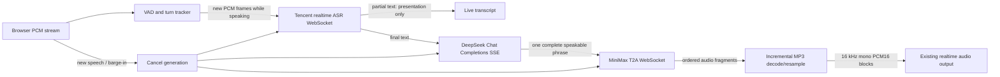

# Provider-Native Streaming Speech Design

## Summary

Convert the Tencent ASR → DeepSeek → MiniMax pipeline from a realtime transport
wrapped around batch speech providers into a provider-native streaming pipeline.
The existing browser and OpenAI Realtime-compatible WebSocket protocol remain
unchanged: clients continue to send and receive bounded PCM audio and never see
provider credentials.

## Goals

- Stream microphone audio to Tencent while the user is speaking.
- Preserve DeepSeek SSE token streaming and begin synthesis after one complete
  speakable sentence rather than three.
- Stream synthesized MiniMax audio to the browser as it is produced.
- Make barge-in close provider streams and fence every late result by turn and
  cancellation generation.
- Measure each stage's time to first useful output.

## Non-goals

- Changing the public realtime protocol or browser PCM contract.
- Exposing Tencent or MiniMax credentials to clients.
- Speaking raw LLM tokens, reasoning, or incomplete tool results.
- Adding a non-streaming fallback that could silently restore batch latency.

## Data Flow

## Tencent Realtime ASR

Add a provider client boundary that creates a newly signed Tencent WebSocket
recognition session for each logical speech turn. `TENCENT_ASR_APP_ID`, SecretID,
and SecretKey remain server-side. Each session uses a unique voice ID.

The VAD stage already emits progressive snapshots containing the utterance so
far. The handler will track the number of samples already sent for the current
turn and transmit only the unseen suffix, divided into provider-paced frames of
at most 200 ms at 16 kHz PCM16 mono. It must never resend a progressive prefix.
On the final VAD message it sends any unseen suffix followed by Tencent's final
frame, then waits for the provider's final recognition result. Partial results
may update the existing live-transcription channel but must not invoke the LLM.

A new turn, stale revision, provider error, cancellation, or cleanup closes the
old socket and invalidates all of its subsequent messages. Authentication URLs
and signatures are never logged.

## DeepSeek Streaming and Phrase Flush

Keep Chat Completions `stream=true`, `deepseek-v4-flash`, and thinking disabled.
The existing SSE iterator remains the source of text deltas. The checked-in
Tencent/DeepSeek/MiniMax profile sets `stream_batch_sentences` to `1`, so each
complete speakable sentence is passed to TTS immediately. Incomplete tokens are
not spoken; remaining text is flushed only at normal response completion.

Cancellation must close the provider stream when supported and continue to
fence emitted chunks by the existing turn/revision and cancellation generation.

## MiniMax Streaming TTS

Replace the synchronous HTTP/WAV request with the official MiniMax WebSocket T2A
protocol. Establish an authenticated connection, send `task_start`, wait for
`task_started`, send one or more ordered `task_continue` messages, consume every
audio fragment until `is_final`, and send `task_finish` during clean shutdown.

MiniMax streaming audio is MP3. A bounded incremental decoder converts fragments
to mono PCM16 and resamples them to the pipeline's existing 16 kHz contract. It
must preserve provider order, retain only the minimum undecoded MP3 state, emit
fixed-size PCM blocks as soon as decoded samples are available, and pad only the
last block. A decode error or protocol-order violation fails the response rather
than skipping or reordering audio.

On barge-in, stale revision, timeout, provider error, or cleanup, close the
socket immediately and discard all late audio. Do not wait for `task_finish` to
drain queued synthesis after cancellation.

## Backpressure and Bounds

- Tencent outbound frames are paced near realtime and bounded by the current
  turn's unseen audio suffix.
- Provider events have explicit maximum JSON and audio fragment sizes.
- MiniMax decoded PCM is emitted into the existing bounded handler queue; the
  provider reader cannot grow an unbounded application buffer.
- All network handshakes, reads, writes, and terminal waits use explicit
  deadlines.
- Only one provider stream is active per pipeline stage and turn.

## Latency and Privacy Observability

Record content-free monotonic timings for:

- speech start to first ASR partial;
- speech end to final ASR result;
- LLM request to first text delta;
- first speakable phrase to MiniMax `task_continue`;
- MiniMax request to first decoded PCM block;
- speech end to first outbound audio block;
- barge-in to provider closure and last accepted audio.

Logs and metrics contain no audio, transcript, signature, credential, provider
payload, or URL query.

## Tests

Red-first provider-contract tests will cover:

- Tencent signing without exposing secrets, 200 ms suffix-only PCM framing,
  partial/final result handling, finalization, error handling, and stale-turn
  closure.
- DeepSeek profile selection and first-sentence downstream flush.
- MiniMax handshake/event order, multiple audio fragments, incremental decode,
  exact output ordering, final-block behavior, size/deadline bounds, provider
  failure, and cancellation closure.
- End-to-end fake-provider timing proving first transcript/audio appears before
  the provider's terminal response and no stale audio crosses a barge-in fence.

Focused provider tests run first, followed by the full speech repository test
suite and formatter/linter checks. Live credentialed provider acceptance remains
an explicit operator test and is not inferred from mocks.
